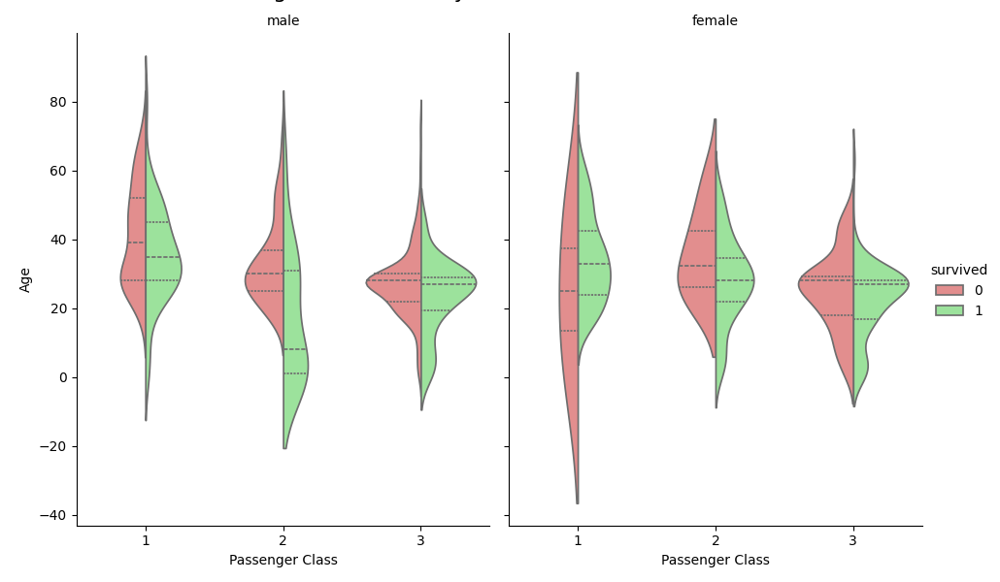
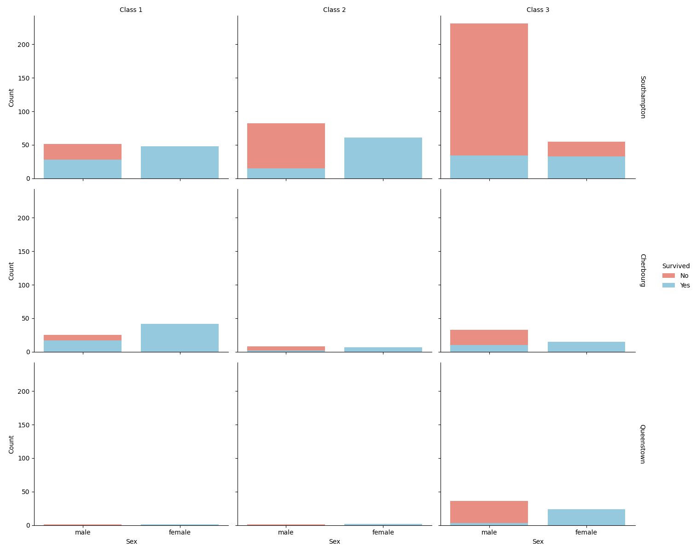
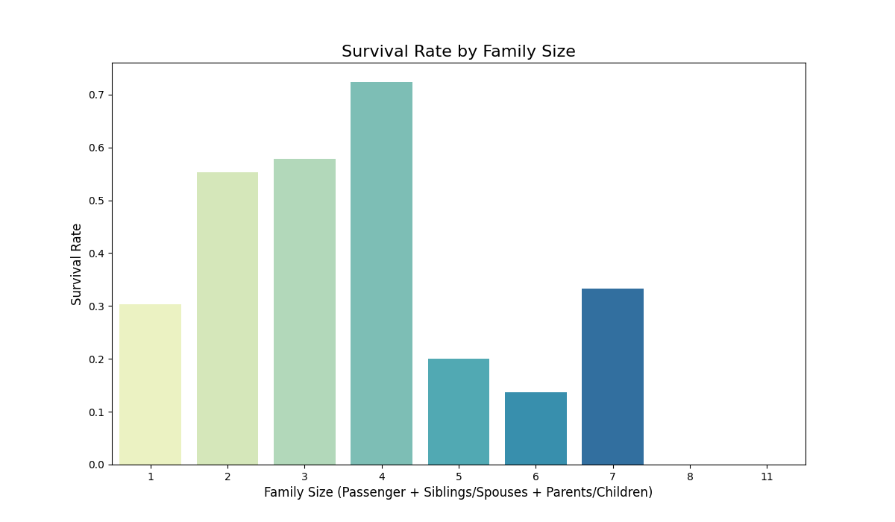
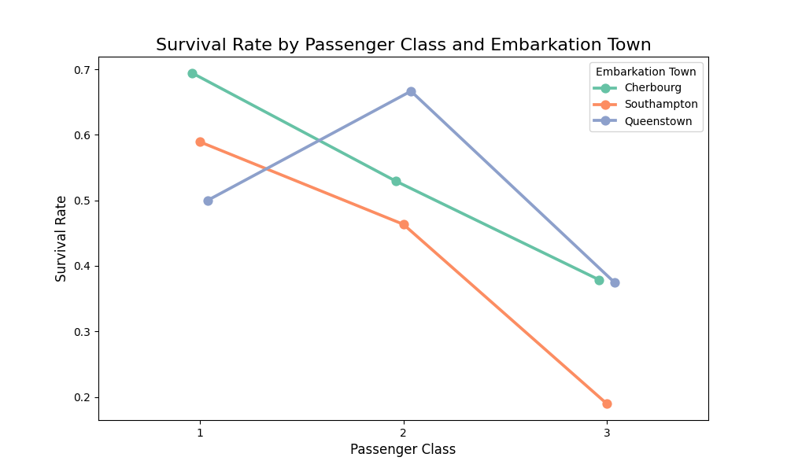
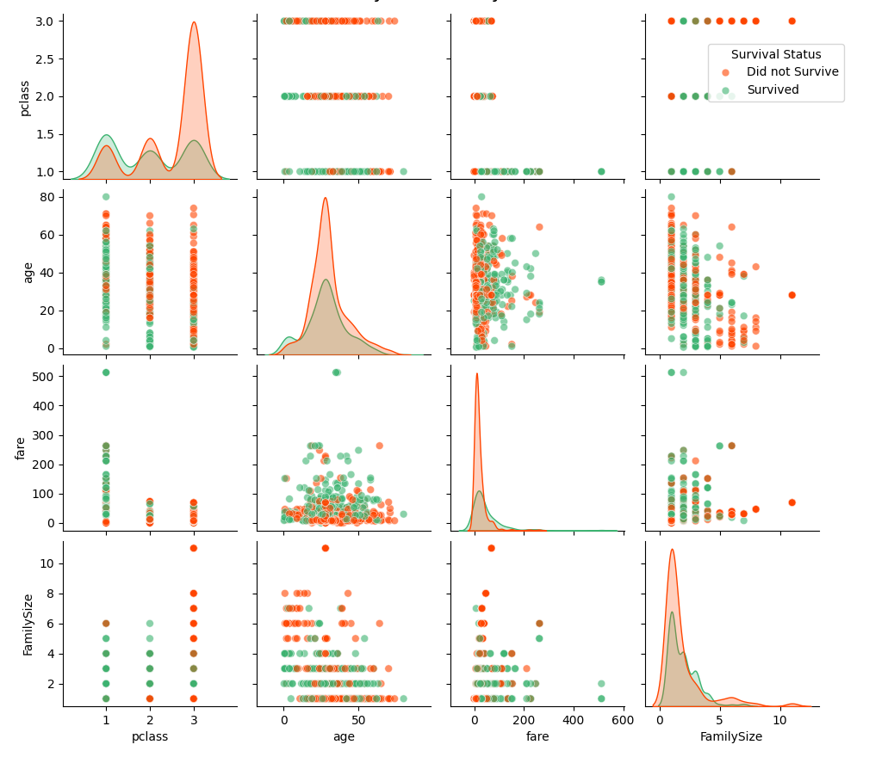

# Titanic Dataset - Exploratory Data Analysis (EDA) and Visualization

**Prepared by:** Mohd Aftaab

## Project Overview

This project focuses on performing an Exploratory Data Analysis (EDA) on the Titanic dataset. The primary goal is to uncover patterns, trends, and insights from the data, particularly concerning passenger survival. Key demographic and socio-economic factors are analyzed to understand their influence on survival rates.

The analysis involves data loading, preprocessing (handling missing values), and the generation of various visualizations to present the findings in an accessible manner.

## Dataset

The primary dataset used for this analysis is `titanic_dataset.csv`, located in the `Assignment/week 3/` directory relative to the project root.

**Data Sourcing:**
*   The `titanic_visualizations.py` script is designed to first check for the existence of `Assignment/week 3/titanic_dataset.csv`.
*   If the file is not found, the script will automatically:
    1.  Create the `Assignment/week 3/` directory if it does not already exist.
    2.  Load the standard Titanic dataset from the Seaborn library (`sns.load_dataset('titanic')`).
    3.  Save this dataset to `Assignment/week 3/titanic_dataset.csv`.
*   Subsequently, all analysis and visualizations are performed using this local CSV file.

This approach ensures that the project is self-contained and uses a consistent dataset, which is a common practice in professional data science projects.

The dataset contains information about passengers on the Titanic, including:

*   `survived`: Survival status (0 = No, 1 = Yes)
*   `pclass`: Passenger class (1 = 1st, 2 = 2nd, 3 = 3rd)
*   `sex`: Gender of the passenger
*   `age`: Age of the passenger
*   `sibsp`: Number of siblings/spouses aboard
*   `parch`: Number of parents/children aboard
*   `fare`: Ticket fare
*   `embarked`: Port of embarkation (C = Cherbourg, Q = Queenstown, S = Southampton)
*   `class`: Passenger class (Categorical representation of `pclass`)
*   `who`: Gender category (man, woman, child)
*   `embark_town`: Embarkation town

## Visualizations

The following visualizations were generated by `titanic_visualizations.py` and are saved in the `visualizations/` directory:

1.  **`survival_count.png`**: A bar plot showing the total count of passengers who survived versus those who did not.
2.  **`survival_rate_by_pclass.png`**: A bar plot illustrating the survival rate for each passenger class (1st, 2nd, 3rd).
3.  **`survival_rate_by_sex.png`**: A bar plot comparing the survival rates of male and female passengers.
4.  **`age_distribution_by_survival.png`**: Histograms (with KDE) showing the age distribution of passengers, separated by survival status.
5.  **`fare_distribution_by_survival.png`**: Histograms (with KDE) showing the distribution of fares paid by passengers (on a log scale), separated by survival status.
6.  **`correlation_heatmap.png`**: A heatmap displaying the correlation matrix for the numerical features in the dataset.
7.  **`survival_rate_by_embark_town.png`**: A bar plot showing the survival rate based on the town of embarkation.

8.  **`age_pclass_sex_survival_violin_catplot.png`**: Advanced Violin Plot (Catplot)
    *   **Image**:
        
    *   **Purpose**: To visualize the age distribution of passengers across different passenger classes (Pclass) and sexes, further segmented by their survival status. Violin plots effectively show the probability density of the data at different values, including quartiles.
    *   **Inferences**:
        *   Children (younger ages) generally had higher survival rates, particularly noticeable for females in Pclass 1 and 2.
        *   Females in Pclass 1 and 2 showed significantly higher survival rates across most age groups compared to males.
        *   In Pclass 3, survival rates were lower overall. Younger passengers (both male and female) had a slightly better chance than older passengers in this class.
        *   Elderly passengers, especially males in lower classes, had lower survival rates.

9.  **`survival_by_pclass_sex_embark_facetgrid.png`**: FacetGrid of Survival Counts
    *   **Image**:
        
    *   **Purpose**: To provide a detailed breakdown of survival counts by simultaneously considering passenger class, sex, and the port of embarkation. This helps identify specific sub-groups with distinct survival patterns.
    *   **Inferences**:
        *   Females consistently had higher survival counts than males across almost all combinations of Pclass and embarkation towns.
        *   Passengers embarking from Cherbourg (C), especially those in Pclass 1 (both male and female), had relatively high survival counts.
        *   Pclass 3 passengers, particularly males, exhibited very low survival counts irrespective of their embarkation town.
        *   Southampton (S) was the port with the largest number of passengers and consequently, the highest number of non-survivors, especially from Pclass 3.

10. **`survival_rate_by_family_size.png`**: Survival Rate by Family Size
    *   **Image**:
        
    *   **Purpose**: To investigate the relationship between the size of a passenger's family (calculated as `sibsp` + `parch` + 1) aboard the Titanic and their likelihood of survival.
    *   **Inferences**:
        *   Passengers who were alone (`FamilySize` = 1) had a notably lower survival rate compared to those in small to medium-sized families.
        *   Small families (2-4 members) generally had the highest survival rates. This could be attributed to families assisting each other or the prioritization of women and children within these family units.
        *   Very large families (`FamilySize` > 4) experienced significantly lower survival rates, possibly due to the increased difficulty in managing and evacuating larger groups during the chaotic sinking.

11. **`survival_rate_by_pclass_embark_town_pointplot.png`**: Survival Rate by Pclass and Embark Town (Point Plot)
    *   **Image**:
        
    *   **Purpose**: To illustrate how survival rates vary across different passenger classes when also considering their port of embarkation. Point plots are effective for comparing trends and interactions between categorical variables.
    *   **Inferences**:
        *   Passengers embarking from Cherbourg (C) generally had higher survival rates across all Pclasses compared to those from Queenstown (Q) or Southampton (S). This advantage is most pronounced in Pclass 1.
        *   Pclass 1 passengers consistently maintained the highest survival rates, regardless of their embarkation town.
        *   Pclass 3 passengers consistently had the lowest survival rates. Those embarking from Queenstown (Q) in Pclass 3 faced particularly grim survival prospects.

12. **`pairplot_key_features_by_survival.png`**: Pair Plot of Key Features by Survival Status
    *   **Image**:
        
    *   **Purpose**: To explore pairwise relationships between key numerical and categorical features (`survived`, `pclass`, `age`, `fare`, `FamilySize`) and how these relationships differ for survived versus non-survived passengers. The diagonal plots show the distribution (Kernel Density Estimate - KDE) of each feature, segmented by survival status.
    *   **Inferences**:
        *   **Age**: Younger passengers (children) show a higher density in the survived group. The age distribution for survivors is skewed towards younger ages.
        *   **Fare**: Passengers who paid higher fares had a better chance of survival. The fare distribution for survivors is shifted towards higher values, indicating that wealthier passengers were more likely to survive.
        *   **Pclass**: Pclass 1 (represented by a lower numerical value) is strongly associated with survival. A majority of survivors are concentrated in Pclass 1.
        *   **FamilySize**: Passengers traveling alone (`FamilySize` = 1) or in very large families (`FamilySize` > 4) show lower survival. Intermediate family sizes (2-4) are associated with a higher density of survivors.
        *   **Interactions**: The scatter plots reveal interactions: for instance, younger passengers in higher classes (1 & 2) had better survival outcomes. Higher fares are predominantly seen in Pclass 1, which correlates with higher survival.

## Running the Analysis

1.  Ensure you have Python installed along with the necessary libraries listed in `requirements.txt` (pandas, matplotlib, seaborn, scikit-learn).
2.  Run the script `titanic_visualizations.py` from the project's root directory:
    ```bash
    python titanic_visualizations.py
    ```
    On the first run (or if `Assignment/week 3/titanic_dataset.csv` is missing), the script will automatically create this CSV file using data from the Seaborn library. Subsequent runs will use the existing CSV.
3.  The generated visualizations will be saved in the `visualizations/` folder, located at the root of the project.

## Requirements

*   pandas
*   matplotlib
*   seaborn
*   scikit-learn (though not explicitly used in the final visualization script, it's in `requirements.txt`)

To install these, you can use:
```bash
pip install -r requirements.txt
```
