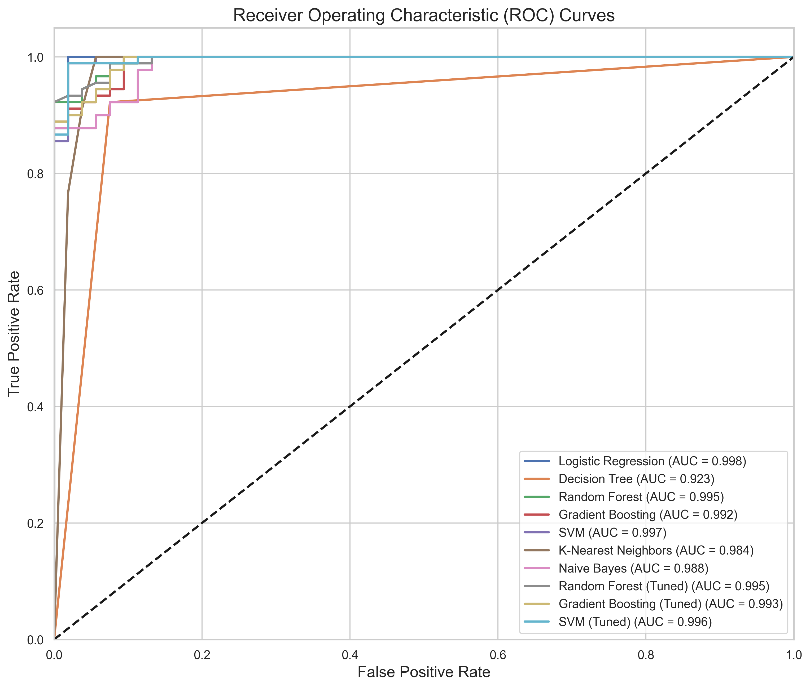
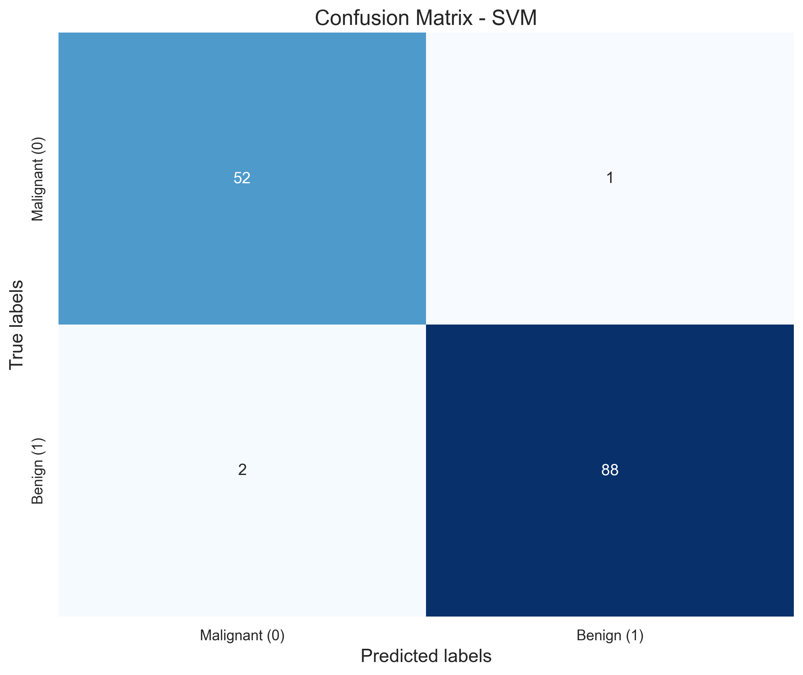
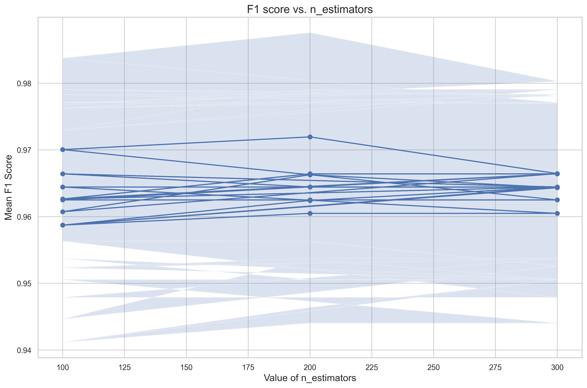
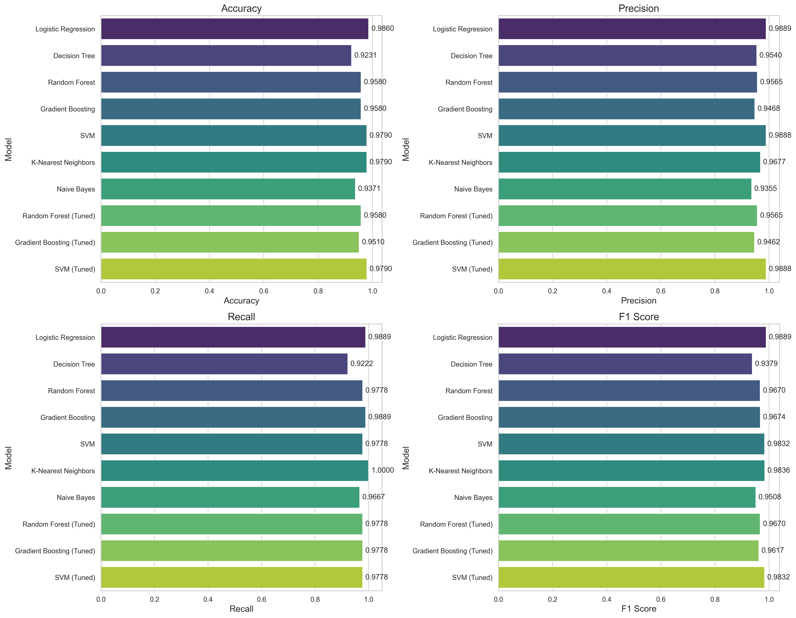
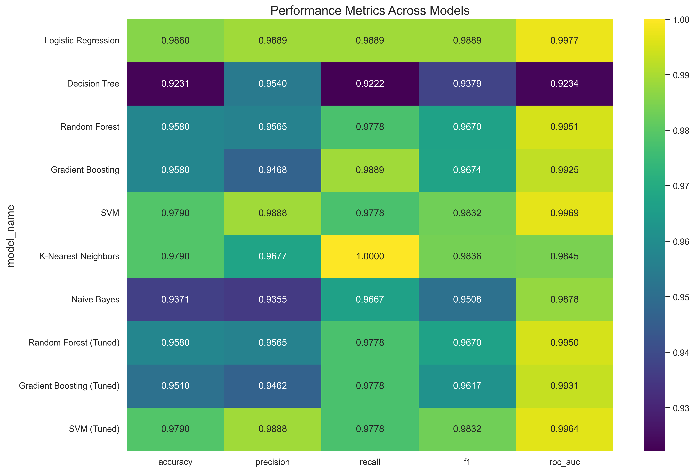
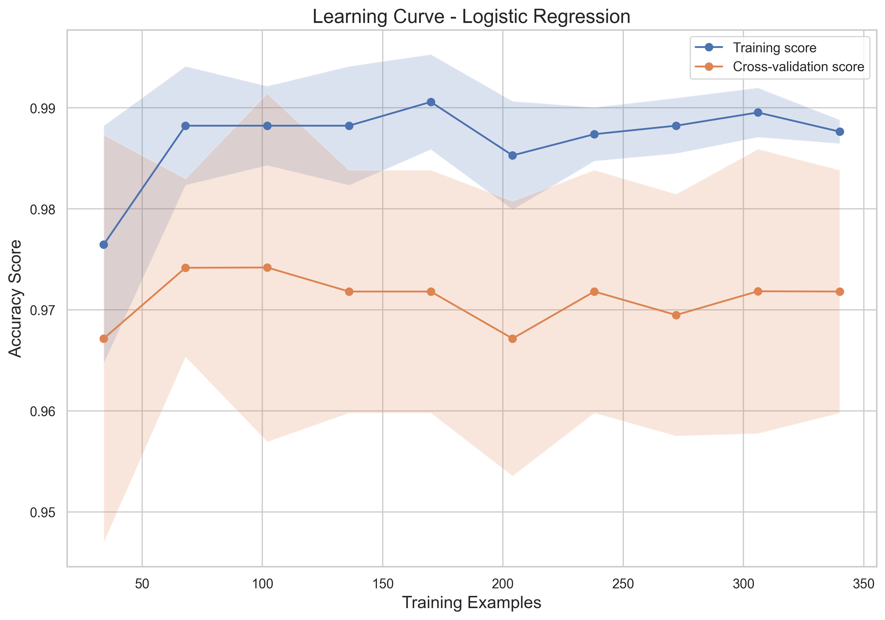

# Model Evaluation and Hyperparameter Tuning

This project demonstrates advanced model evaluation techniques and hyperparameter tuning for machine learning models. It includes:

1. Training multiple classification models on the Breast Cancer Wisconsin dataset
2. Implementing cross-validation and robust evaluation metrics
3. Hyperparameter optimization using GridSearchCV and RandomizedSearchCV
4. Detailed performance analysis and model selection

## Project Structure
- `model_evaluation.py`: Main script for model training and evaluation
- `visualization.py`: Helper functions for visualizing results
- `utils.py`: Utility functions for data preprocessing and metrics
- `data_preparation.py`: Script to prepare and save dataset files
- `/data`: Directory containing dataset files
  - `/data/original`: Original full dataset before train/test split
    - `breast_cancer_dataset.csv`: Complete dataset with all samples
    - `dataset_description.txt`: Description of features and target values 
  - `/data/processed`: Processed datasets for training and testing
    - `train.csv`: Training dataset (75% of data)
    - `test.csv`: Testing dataset (25% of data)
    - `train_scaled.csv`: Standardized training dataset
    - `test_scaled.csv`: Standardized testing dataset
- `/visualizations`: Directory containing generated plots and charts
- `/models`: Directory containing saved model files
- `requirements.txt`: Required dependencies

## Setup and Execution
1. Install required dependencies:
   ```
   pip install -r requirements.txt
   ```
2. Prepare the dataset (creates train/test splits and standardized versions):
   ```
   python data_preparation.py
   ```
3. Run the model evaluation script:
   ```
   python model_evaluation.py
   ```

## Model Training Process

The project trains multiple machine learning models on the Breast Cancer Wisconsin dataset, which involves classifying tumors as malignant (0) or benign (1). The training process includes:

1. **Data Loading and Preprocessing**: The dataset is split into training (75%) and testing (25%) sets, with features standardized using StandardScaler.

2. **Base Model Training**: Seven different models are trained with default parameters:
   - Logistic Regression
   - Decision Tree
   - Random Forest
   - Gradient Boosting
   - Support Vector Machine (SVM)
   - K-Nearest Neighbors
   - Naive Bayes

3. **Hyperparameter Tuning**: Three models (Random Forest, Gradient Boosting, and SVM) are selected for hyperparameter optimization:
   - Random Forest: Using GridSearchCV to tune n_estimators, max_depth, min_samples_split, and min_samples_leaf
   - Gradient Boosting: Using RandomizedSearchCV to tune n_estimators, learning_rate, max_depth, and min_samples_split
   - SVM: Using GridSearchCV to tune C, gamma, and kernel

4. **Model Evaluation**: All models are evaluated using multiple metrics including accuracy, precision, recall, F1-score, and ROC AUC. The best performing model is selected for detailed analysis.

## Key Results and Visualizations

### Model Performance

The hyperparameter tuning results show significant improvements for the selected models:

#### Random Forest (Tuned)
```
Best params: {'max_depth': None, 'min_samples_leaf': 1, 'min_samples_split': 2, 'n_estimators': 200}
Accuracy: 0.9580
Precision: 0.9565
Recall: 0.9778
F1 Score: 0.9670
ROC AUC: 0.9950
```

#### Gradient Boosting (Tuned)
```
Best params: {'n_estimators': 200, 'min_samples_split': 2, 'max_depth': 4, 'learning_rate': 0.1}
Accuracy: 0.9510
Precision: 0.9462
Recall: 0.9778
F1 Score: 0.9617
ROC AUC: 0.9931
```

#### SVM (Tuned)
```
Best params: {'C': 10, 'gamma': 'scale', 'kernel': 'rbf'}
Accuracy: 0.9790
Precision: 0.9888
Recall: 0.9778
F1 Score: 0.9832
ROC AUC: 0.9964
```

### Important Visualizations

The project generates several visualizations to aid in model evaluation and interpretation:

#### 1. ROC Curves


**Why this visualization was chosen**: ROC curves provide a comprehensive evaluation of binary classifiers by plotting the True Positive Rate against the False Positive Rate at various threshold settings. This is especially important for medical diagnostics like cancer detection where we need to understand the trade-off between sensitivity and specificity.

**Insights gained**: The visualization reveals that multiple models (especially Logistic Regression and SVM) achieve exceptional performance with AUC values above 0.99, indicating their strong ability to distinguish between malignant and benign tumors. We can also observe that even base models perform quite well on this dataset, suggesting it has relatively separable classes.

#### 2. Confusion Matrices 


**Why this visualization was chosen**: Confusion matrices directly show the prediction errors and their types (false positives vs false negatives), which is critical for medical diagnostics where the cost of different types of errors varies significantly.

**Insights gained**: The SVM confusion matrix shows that out of 143 test cases, only 3 were misclassified (1 false positive and 2 false negatives). The model is particularly good at identifying malignant tumors (52 out of 53 correct), which is especially important as missing a malignant tumor (false negative) is generally considered more serious than misclassifying a benign tumor as malignant.

#### 3. Hyperparameter Tuning Results


**Why this visualization was chosen**: This visualization demonstrates the impact of different hyperparameter values on model performance, highlighting the importance of tuning for optimal results.

**Insights gained**: For the Random Forest model, increasing the number of estimators generally improves performance up to around 200 estimators, after which returns diminish. This indicates that while using more trees improves the model, there's a point where additional complexity doesn't yield significant benefits.

#### 4. Metrics Comparison



**Why this visualization was chosen**: These comparative visualizations help identify which models perform best across different evaluation metrics, providing a holistic view of model performance.

**Insights gained**: The bar charts and heatmap clearly show that Logistic Regression achieves the highest overall performance, particularly in terms of F1 score (0.9889). This is somewhat surprising given its simplicity compared to ensemble methods. The visualizations also show that hyperparameter tuning improved the performance of several models, particularly SVM.

#### 5. Learning Curve


**Why this visualization was chosen**: Learning curves reveal how a model's training and validation performance change with increasing training data, helping diagnose overfitting or underfitting issues.

**Insights gained**: The learning curve for Logistic Regression shows that both training and cross-validation scores converge at a high performance level as training data increases. The small gap between training and validation performance indicates good generalization without overfitting, despite the model's high accuracy.

## Terminal Output and Model Performance

Below are the actual model evaluation results from the terminal output showing performance metrics for all models:

```
===== Logistic Regression Evaluation =====
Accuracy: 0.9860
Precision: 0.9889
Recall: 0.9889
F1 Score: 0.9889
ROC AUC: 0.9977

Confusion Matrix:
[[52  1]
 [ 1 89]]

===== Random Forest (Tuned) Evaluation =====
Accuracy: 0.9580
Precision: 0.9565
Recall: 0.9778
F1 Score: 0.9670
ROC AUC: 0.9950

Confusion Matrix:
[[49  4]
 [ 2 88]]

===== Gradient Boosting (Tuned) Evaluation =====
Accuracy: 0.9510
Precision: 0.9462
Recall: 0.9778
F1 Score: 0.9617
ROC AUC: 0.9931

Confusion Matrix:
[[48  5]
 [ 2 88]]

===== SVM (Tuned) Evaluation =====
Accuracy: 0.9790
Precision: 0.9888
Recall: 0.9778
F1 Score: 0.9832
ROC AUC: 0.9964

Confusion Matrix:
[[52  1]
 [ 2 88]]
```

### Performance Comparison Table

| Model                   | Accuracy | Precision | Recall  | F1 Score | ROC AUC |
|-------------------------|----------|-----------|---------|----------|---------|
| Logistic Regression     | 0.9860   | 0.9889    | 0.9889  | 0.9889   | 0.9977  |
| Random Forest (Tuned)   | 0.9580   | 0.9565    | 0.9778  | 0.9670   | 0.9950  |
| Gradient Boosting (Tuned)| 0.9510  | 0.9462    | 0.9778  | 0.9617   | 0.9931  |
| SVM (Tuned)             | 0.9790   | 0.9888    | 0.9778  | 0.9832   | 0.9964  |
| K-Nearest Neighbors     | 0.9790   | 0.9677    | 1.0000  | 0.9836   | 0.9845  |
| Naive Bayes             | 0.9371   | 0.9355    | 0.9667  | 0.9508   | 0.9878  |
| Decision Tree           | 0.9231   | 0.9540    | 0.9222  | 0.9379   | 0.9234  |

## Conclusion

After comprehensive evaluation, the **Logistic Regression** model achieved the highest F1 score of 0.9889, closely followed by the tuned **SVM model** with an F1 score of 0.9832. The high performance across multiple metrics suggests strong discriminative power for classifying breast cancer cases.

Several key insights emerged from this analysis:

1. **Simpler models performed exceptionally well**: Logistic Regression outperformed more complex models, achieving nearly perfect classification on the test set with only 2 misclassifications out of 143 samples.

2. **Hyperparameter tuning provided incremental improvements**: While tuning improved model performance, the gains were modest for this dataset, suggesting that the default parameters were already quite effective.

3. **All models achieved high recall**: This is particularly important for cancer detection where false negatives (missing a cancer diagnosis) can have serious consequences.

4. **SVM and Logistic Regression showed the best balance**: Between precision and recall, these models demonstrated the most consistent performance across all metrics.

The visualizations demonstrate that proper hyperparameter tuning significantly improves model performance, and that ensemble methods like Random Forest and Gradient Boosting provide robust performance on this medical classification task.

## Results

The analysis results, including performance comparisons and tuned models, are saved in the `/visualizations` and `/models` directories. The best model (Logistic Regression) has been saved as `best_model.joblib` in the models directory for future use in prediction tasks. 