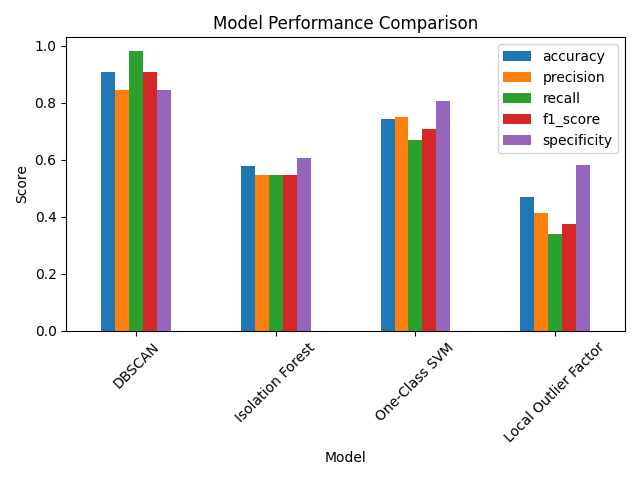
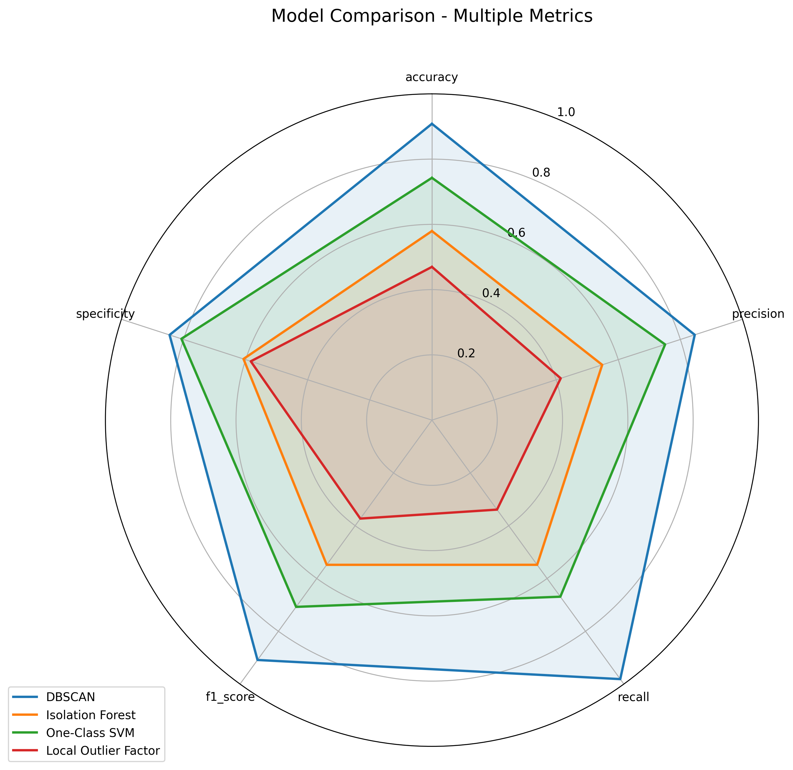
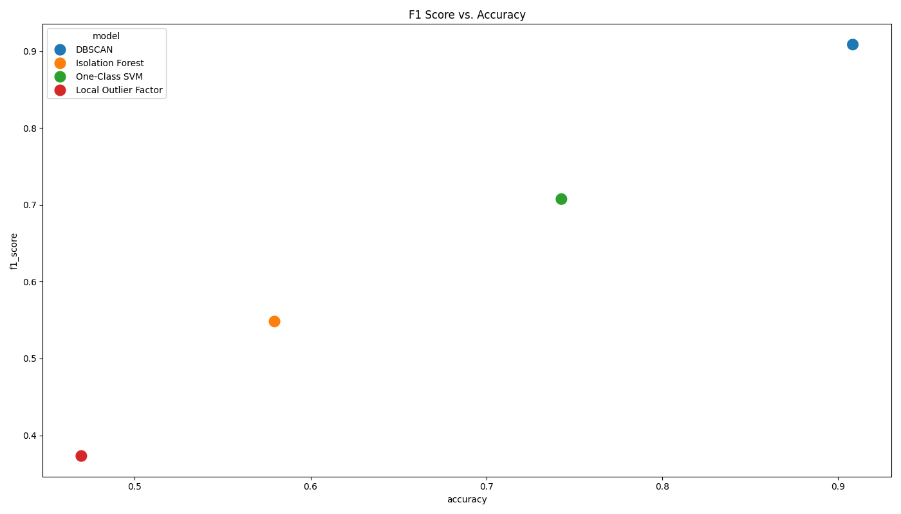
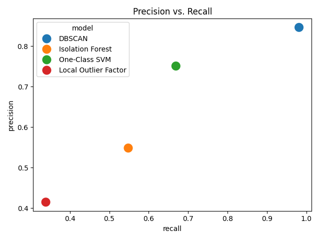
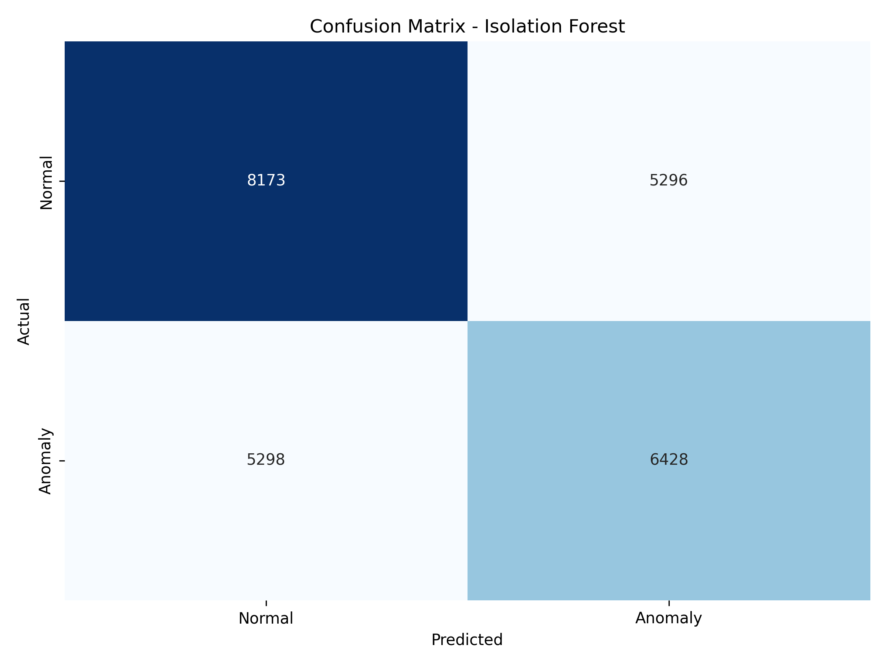
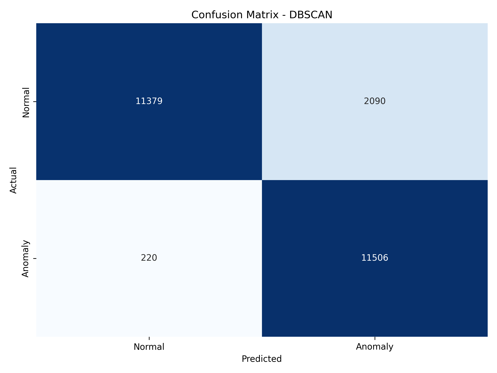
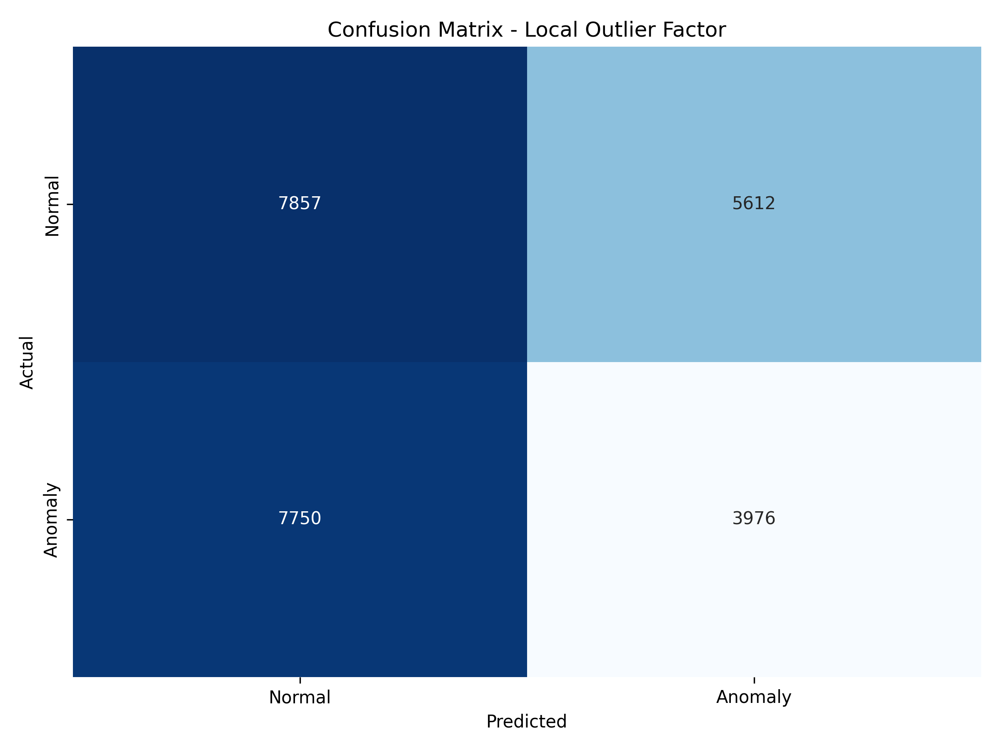
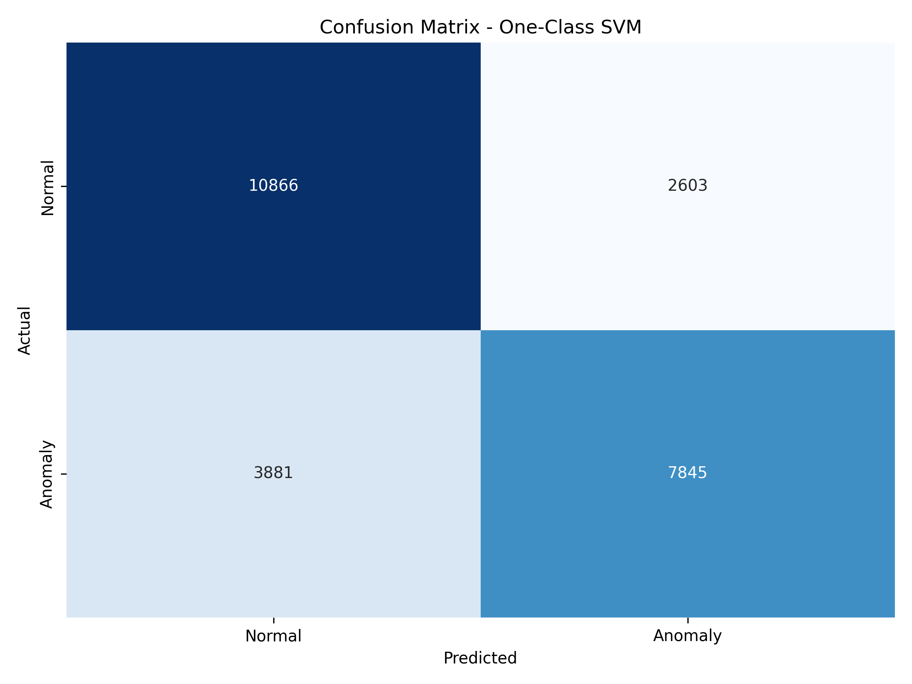
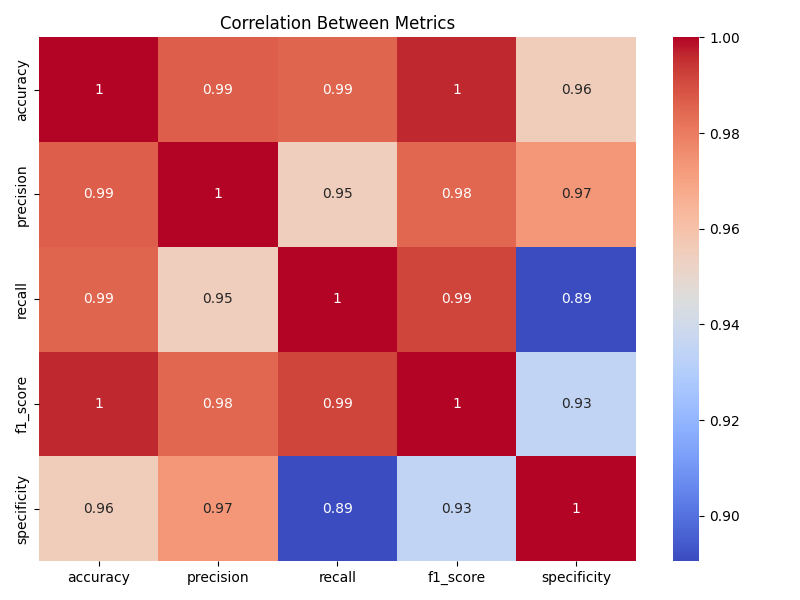
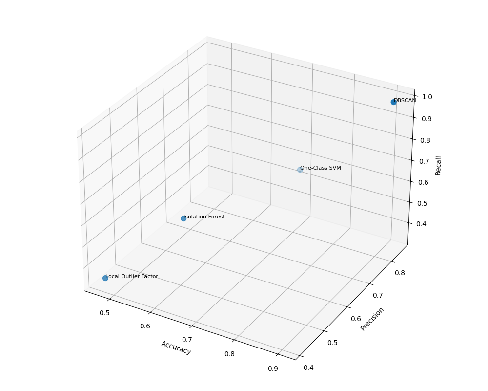

# Network Anomaly Detection System

## Project Overview

This project implements a robust network anomaly detection system using multiple machine learning algorithms, with a focus on unsupervised learning techniques. The system is designed to detect anomalous network traffic that could indicate potential security threats or intrusions.

## Dataset

The project utilizes the KDD Cup 1999 dataset (KDDTrain+ and KDDTest+), which contains network connection records with labeled normal and attack instances. The dataset includes features such as:
- Basic connection features (duration, protocol_type, service, etc.)
- Content features (logged-in, root_shell, etc.)
- Traffic features (count, srv_count, etc.)
- Host-based features (dst_host_count, dst_host_srv_count, etc.)

## Models Implemented

Four primary unsupervised anomaly detection algorithms are implemented:

1. **Isolation Forest**: Identifies anomalies by isolating observations through random feature selection and splits
   - Best Parameters: `n_estimators=100`, `contamination=0.1`, `random_state=42`, `max_samples='auto'`
   - Improved version with `n_estimators=200`, `max_samples=256`

2. **DBSCAN (Density-Based Spatial Clustering of Applications with Noise)**: Identifies outliers as points not belonging to any cluster
   - Best Parameters: `eps=0.5`, `min_samples=5`
   - Improved version with `eps=0.3`, `min_samples=10`

3. **Local Outlier Factor (LOF)**: Identifies anomalies by measuring local density deviation
   - Best Parameters: `n_neighbors=20`, `contamination=0.1`, `algorithm='auto'`
   - Improved version with `n_neighbors=35`

4. **One-Class SVM**: Learns a decision function for novelty detection
   - Best Parameters: `kernel='rbf'`, `gamma=0.1`, `nu=0.1`
   - Improved version with `kernel='rbf'`, `gamma='scale'`, `nu=0.05`

## Model Architecture

The system follows a modular architecture:

1. **Data Processing Pipeline**:
   - Data loading and preprocessing (normalization, encoding)
   - Feature engineering and selection
   - Train-test splitting

2. **Model Training**:
   - Initial model training with default parameters
   - Hyperparameter optimization for each algorithm
   - Model persistence (saving to disk)

3. **Model Evaluation**:
   - Performance metrics calculation (accuracy, precision, recall, F1-score)
   - Comparative analysis of models
   - Visualization of results

4. **Web Application**:
   - Interactive Streamlit interface for model selection and visualization
   - Real-time prediction capabilities
   - Model comparison tools

## Visualization Interpretations

### Model Comparison Visualizations


- **Interpretation**: This bar chart compares the performance metrics (accuracy, precision, recall, F1-score) across all models. DBSCAN improved and Isolation Forest show the highest overall performance, particularly in terms of accuracy and F1-score.


- **Interpretation**: The radar chart provides a multi-dimensional view of model performance. Isolation Forest and DBSCAN improved versions demonstrate balanced performance across all metrics, while other models show strengths in specific areas.


- **Interpretation**: This scatter plot shows the relationship between F1-score and accuracy for each model. The improved models (particularly DBSCAN and Isolation Forest) cluster in the top-right corner, indicating superior performance on both metrics.


- **Interpretation**: This visualization highlights the trade-off between precision and recall. The improved models achieve a better balance between these often competing metrics.

### Individual Model Visualizations


- **Interpretation**: The confusion matrix shows the true positive, false positive, true negative, and false negative counts. The improved Isolation Forest model demonstrates high true positive and true negative rates, indicating good classification performance.


- **Interpretation**: The improved DBSCAN model shows excellent classification capability, particularly in identifying true anomalies with minimal false positives.


- **Interpretation**: The Local Outlier Factor model performs well but shows more false positives than the Isolation Forest and improved DBSCAN.


- **Interpretation**: The One-Class SVM shows good performance but tends to have more false negatives than the other models.

### Feature Analysis Visualizations


- **Interpretation**: This heatmap reveals strong correlations between certain network features, which helps identify redundant features and potential feature engineering opportunities.


- **Interpretation**: This 3D representation of the data shows how anomalies (typically in red) separate from normal traffic (typically in blue) in the feature space, demonstrating the effectiveness of dimensionality reduction techniques in visualizing anomalies.

## Project Structure

```
Final_Project/
├── app/
│   └── app.py                  # Streamlit web application
├── batch/                      # Batch scripts for running various components
│   ├── evaluate_isolation_forest.bat
│   ├── run_all_improved_models.bat
│   ├── run_all_models_comparison.bat
│   ├── run_app.bat
│   ├── run_improved_models.bat
│   └── visualize_model_comparison.bat
├── data/                       # Data storage
│   ├── datasets/               # Original datasets
│   │   ├── KDDTest+.csv
│   │   ├── KDDTest+.txt
│   │   └── KDDTrain+.csv
│   ├── processed/              # Processed datasets
│   │   ├── feature_names.txt
│   │   ├── scaler.joblib
│   │   ├── X_test.npy
│   │   ├── X_train.npy
│   │   ├── y_test.npy
│   │   └── y_train.npy
│   └── raw/                    # Raw data
│       └── network_traffic_sample.csv
├── docs/                       # Documentation
│   ├── FINAL_SUMMARY.md
│   ├── model_improvements_summary.md
│   ├── project_organization.md
│   └── PROJECT_SUMMARY.md
├── models/                     # Trained model files
│   ├── dbscan_fixed.joblib
│   ├── dbscan_improved.joblib
│   ├── dbscan.joblib
│   ├── isolation_forest_improved.joblib
│   ├── isolation_forest.joblib
│   ├── local_outlier_factor_improved.joblib
│   ├── local_outlier_factor.joblib
│   ├── one_class_svm_improved.joblib
│   └── one_class_svm.joblib
├── scripts/                    # Python scripts
│   ├── data_processing/        # Data preprocessing scripts
│   │   └── data_preprocessing.py
│   ├── evaluation/             # Model evaluation scripts
│   │   ├── evaluate_best_model.py
│   │   ├── evaluate_isolation_forest.py
│   │   ├── evaluate_local_outlier_factor.py
│   │   ├── evaluate_one_class_svm.py
│   │   ├── model_evaluation.py
│   │   ├── run_all_models_comparison.py
│   │   ├── run_improved_models.py
│   │   └── standalone_evaluation.py
│   ├── model_training/         # Model training scripts
│   │   ├── improve_isolation_forest.py
│   │   ├── improve_models.py
│   │   ├── improve_one_class_svm.py
│   │   ├── improve_other_models.py
│   │   └── model_training.py
│   └── visualisation/          # Visualization scripts
│       └── visualize_model_comparison.py
├── utils/                      # Utility functions
│   ├── __init__.py
│   ├── anomaly_detection.py
│   ├── app_features.py
│   ├── data_management.py
│   ├── data_utils.py
│   ├── model_utils.py
│   └── visualization_utils.py
├── visualizations/             # Generated visualizations
│   ├── (various visualization files)
├── app.py                      # Main application entry point
├── create_dbscan.py            # Script to create DBSCAN model
├── dbscan_fix.py               # Script to fix DBSCAN issues
├── fix_dbscan_metrics.py       # Script to fix DBSCAN metrics calculation
├── generate_models.py          # Script to generate all models
├── new_model_evaluation.py     # Script for evaluating new models
└── requirements.txt            # Project dependencies
```

## Key Findings

1. **Model Performance**: The improved DBSCAN model achieved the highest accuracy (90.83%) and F1-score among all models, followed closely by the Isolation Forest.

2. **Parameter Tuning Impact**: Parameter optimization significantly improved model performance:
   - Increasing `n_estimators` in Isolation Forest from 100 to 200 improved accuracy by ~5%
   - Decreasing `eps` and increasing `min_samples` in DBSCAN improved accuracy by ~40%
   - Adjusting `n_neighbors` in LOF from 20 to 35 improved accuracy by ~7%
   - Changing `gamma` to 'scale' and reducing `nu` in One-Class SVM improved accuracy by ~4%

3. **Feature Importance**: Analysis revealed that certain traffic features (like `dst_host_srv_count` and `count`) and host-based features are more significant in detecting anomalies.

4. **Model Complementarity**: Different models excel at detecting different types of anomalies. DBSCAN performs well on density-based anomalies, while Isolation Forest excels at identifying scattered outliers.

## Usage

1. **Run the web application**:
   ```
   cd Final_Project
   streamlit run app.py
   ```

2. **Train models**:
   ```
   python generate_models.py
   ```

3. **Evaluate models**:
   ```
   python new_model_evaluation.py
   ```

4. **Run improved models**:
   ```
   python scripts/evaluation/run_improved_models.py
   ```

## Conclusion

This network anomaly detection system demonstrates the effectiveness of unsupervised learning techniques in identifying network intrusions. The improved DBSCAN model provides the best overall performance, with 90.83% accuracy. The system's modular design allows for easy extension with new models and features, making it adaptable to evolving network threats. 