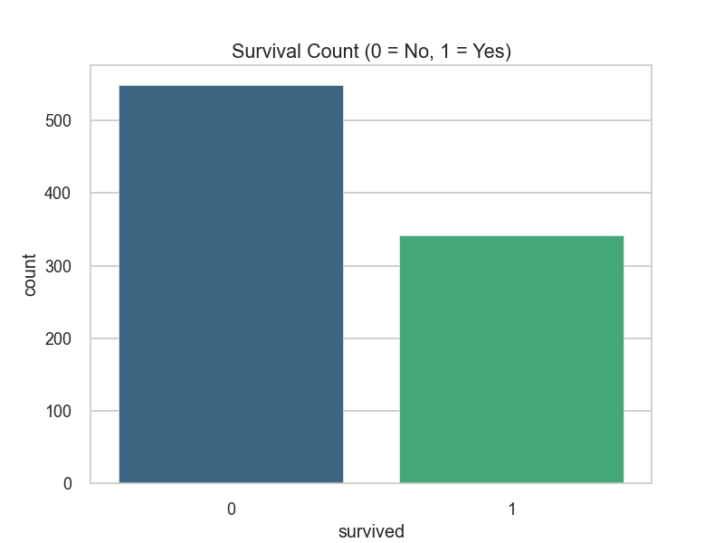
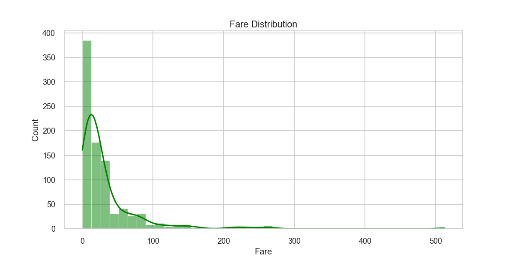

# Week 4 Assignment: In-Depth Titanic Exploratory Data Analysis (EDA)

This project conducts a comprehensive Exploratory Data Analysis (EDA) on the classic Titanic dataset. The goal is to uncover patterns, identify key factors influencing survival, and visualize the relationships between different variables.

## What is Exploratory Data Analysis (EDA)?

Exploratory Data Analysis is an approach to analyzing data sets to summarize their main characteristics, often with visual methods. It is a critical first step in any data science project, allowing us to make sense of the data before applying more complex modeling techniques. The primary goals of this EDA are to:

- **Understand Data Distributions**: Examine the spread and central tendency of key variables. For example, how are the ages of the passengers distributed?
- **Identify Missing Values**: Detect and handle missing data points that could otherwise cause errors or lead to biased conclusions.
- **Detect Outliers**: Identify unusual data points that deviate significantly from the rest of the data and may require special attention.
- **Uncover Relationships**: Investigate the connections and correlations between different variables. For instance, is there a relationship between a passenger's class and their chance of survival?

To achieve this, we utilize a range of statistical graphics and data visualization techniques, including histograms, box plots, and heatmaps, to support our findings and present them in an intuitive way.

## Project Structure

- `eda_titanic.py`: The Python script containing all the code for data loading, cleaning, feature engineering, and visualization.
- `requirements.txt`: A file listing the necessary Python libraries for this project.
- `visualizations/`: A directory where all the generated plots are saved.
- `README.md`: This file, providing a detailed walkthrough of the analysis.

## Analysis and Visualizations

The analysis is divided into several steps, from initial data inspection to advanced visualizations.

### 1. Initial Data Overview

The dataset was first loaded and inspected to understand its structure, data types, and missing values. Key findings include missing data in `age`, `deck`, and `embarked` columns.

### 2. Data Cleaning and Feature Engineering

- **Missing Values**: Missing `age` values were filled with the median, `embarked` with the mode, and the `deck` column was dropped due to a high number of missing entries.
- **New Features**:
  - `family_size`: Created by summing `sibsp` and `parch` to represent the total number of family members aboard.
  - `is_alone`: A binary flag indicating if a passenger was traveling alone.

### 3. Visual Insights

Here are the visualizations generated to explore the data, along with key inferences.

#### 1. Survival Count
- **Purpose**: To see the overall distribution of survival.
- **Inference**: Fewer people survived than perished.
- **Image**:
  

#### 2. Survival by Sex
- **Purpose**: To analyze the impact of gender on survival.
- **Inference**: Females had a significantly higher survival rate than males, highlighting the "women and children first" protocol.
- **Image**:
  

#### 3. Survival by Passenger Class (Pclass)
- **Purpose**: To understand the relationship between socio-economic status and survival.
- **Inference**: Passengers in the 1st class had a much higher survival rate, while 3rd class passengers had the lowest.
- **Image**:
  

#### 4. Age Distribution of Passengers
- **Purpose**: To visualize the age distribution of all passengers.
- **Inference**: The passenger population was concentrated in the 20-40 age range. There were also a notable number of children.
- **Image**:
  

#### 5. Age Distribution by Survival Status
- **Purpose**: To see how age influenced survival.
- **Inference**: Young children (below 10) had a higher survival rate. For adults, the survival distribution is fairly even, though a large number of young adults (20-30) did not survive.
- **Image**:
  

#### 6. Fare Distribution
- **Purpose**: To understand the distribution of fares paid by passengers.
- **Inference**: The fare distribution is heavily skewed to the right, with most passengers paying lower fares.
- **Image**:
  

#### 7. Survival by Family Size
- **Purpose**: To investigate the effect of family size on survival.
- **Inference**: Passengers who were alone had a lower survival rate than those in small families (2-4 members). Very large families also had a lower survival rate.
- **Image**:
  

#### 8. Age Distribution by Pclass and Sex
- **Purpose**: To examine the combined effect of class and gender on age distribution.
- **Inference**: 1st class passengers were generally older than those in other classes. The age distribution for males and females within each class is similar.
- **Image**:
  

#### 9. Correlation Heatmap
- **Purpose**: To visualize the correlation between numerical features.
- **Inference**: `Pclass` has a strong negative correlation with `survived`, meaning a lower class number (e.g., 1st class) is associated with higher survival. `Fare` is positively correlated with `survived`.
- **Image**:
  

#### 10. Pairplot of Key Features
- **Purpose**: To visualize pairwise relationships between key numerical variables, segmented by survival status.
- **Inference**: This plot provides a dense summary of relationships. For instance, we can see that higher fares are associated with survival, and these passengers are predominantly in 1st class.
- **Image**:
  

## Conclusion

This in-depth EDA reveals that the primary factors influencing survival on the Titanic were **gender**, **passenger class**, and **age**. Females, first-class passengers, and children had the highest chances of survival. Feature engineering, by creating `family_size`, provided deeper insights into the social dynamics at play during the tragedy.
