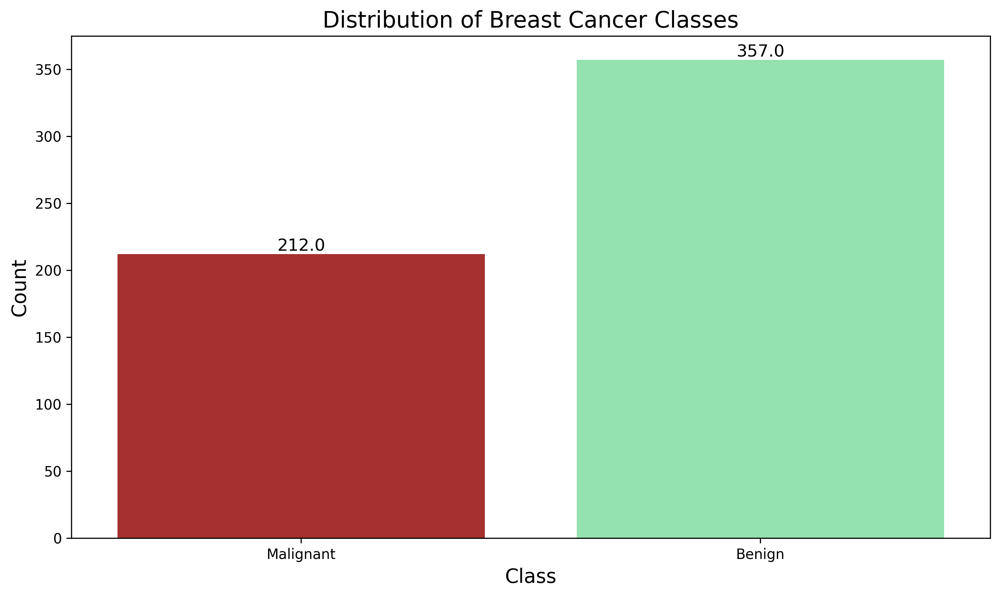
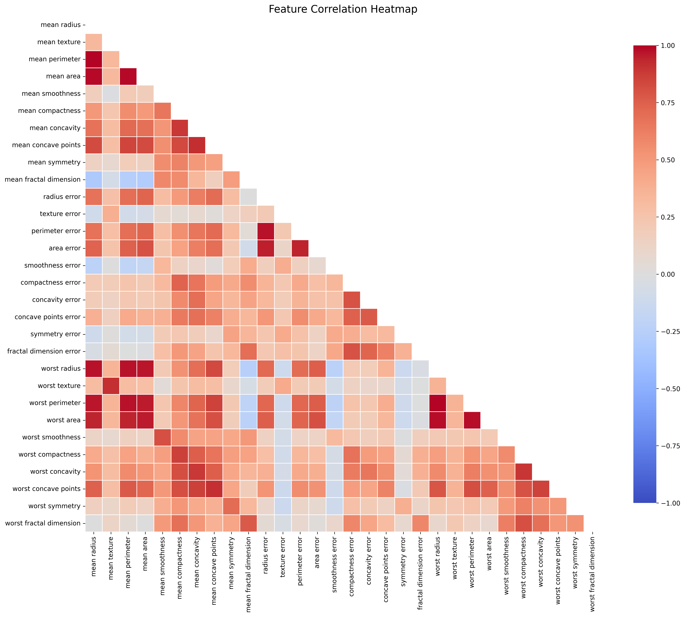
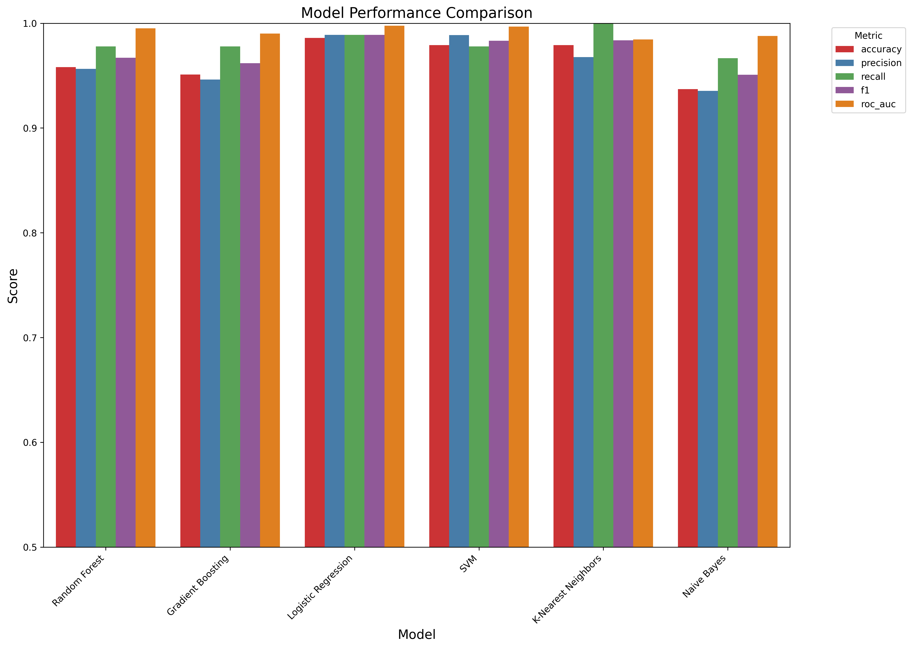
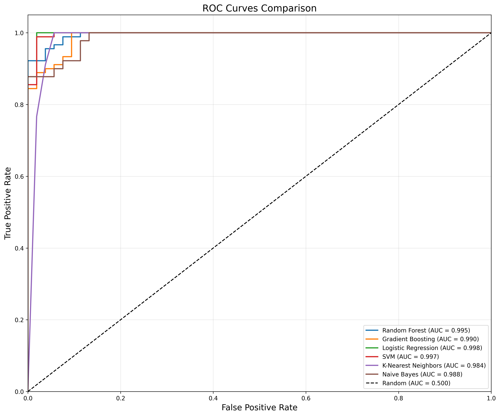
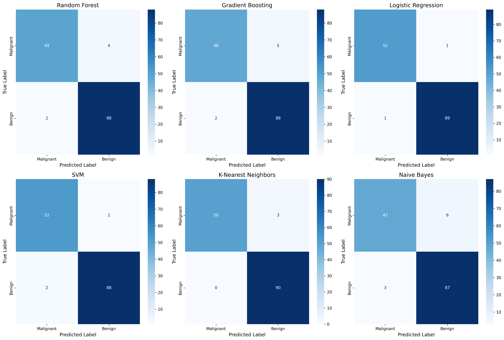
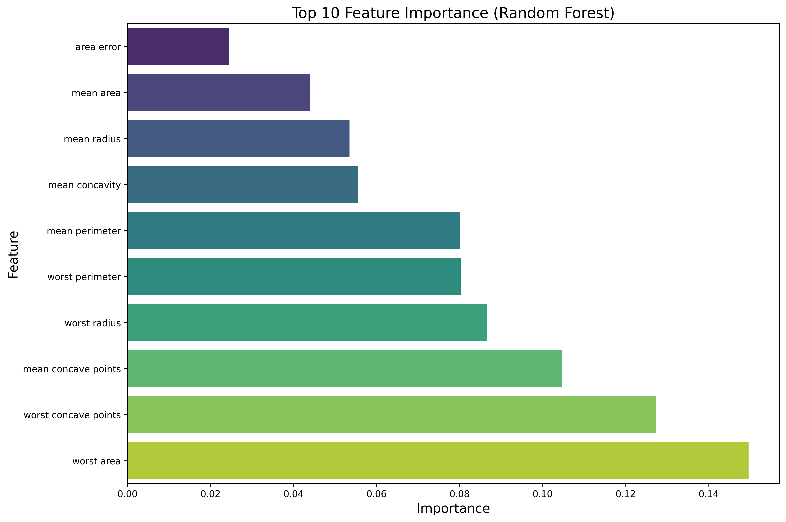
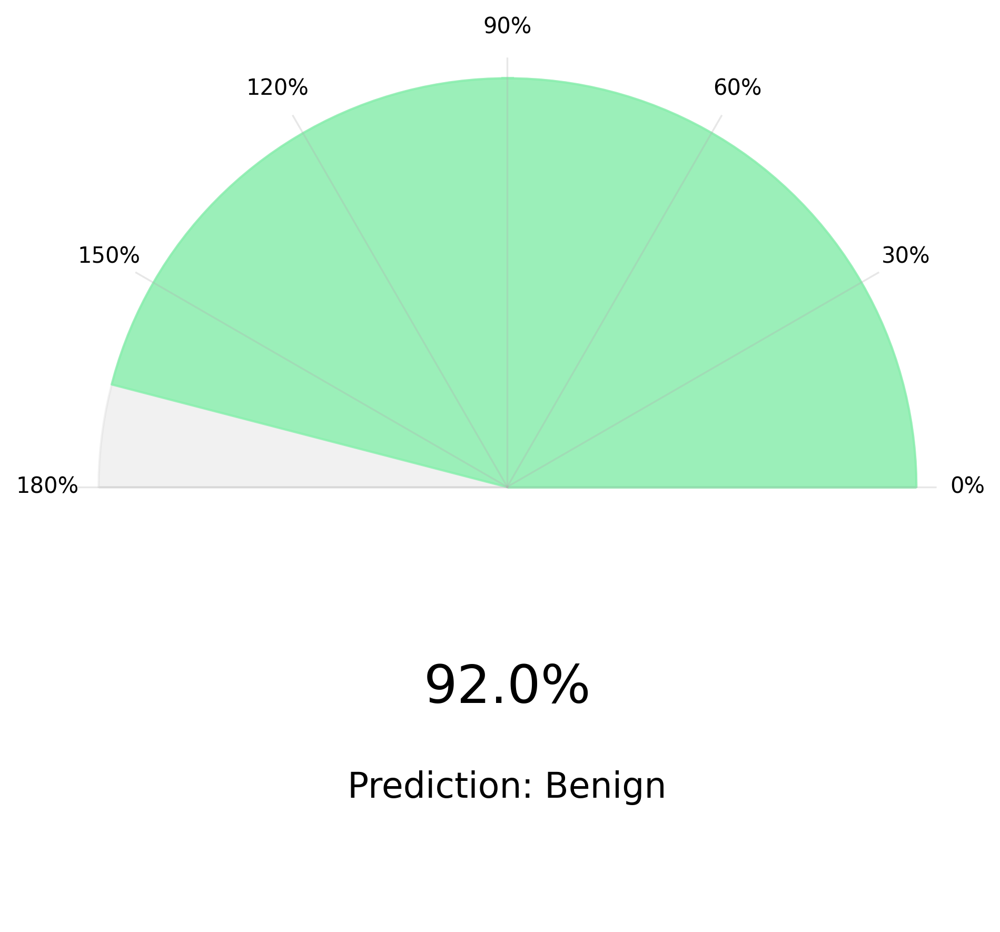
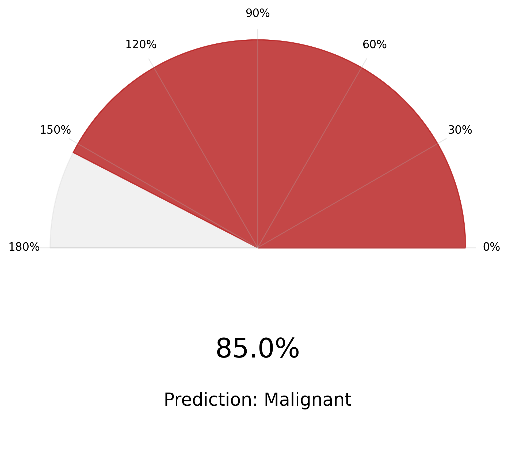

# Breast Cancer Prediction Web Application

**Live Demo:** [Check out the deployed app!](https://moaftaab-celebal-csi-data-science-assignmentweek-7app-dmwt2h.streamlit.app/)

This interactive web application provides a user-friendly interface for breast cancer prediction using machine learning. The application allows users to input patient data, receive predictions on cancer malignancy, and explore model performance metrics through various visualizations.

## How to Run This Project

### Prerequisites
- Python 3.8 or higher
- pip (Python package installer)

### Installation Steps

1. **Clone or download the repository**

2. **Navigate to the project directory**
   ```
   cd path/to/Assignment/week_7
   ```

3. **Install required dependencies**
   ```
   pip install -r requirements.txt
   ```

4. **Run the Streamlit application**
   ```
   streamlit run app.py
   ```

5. **Access the web interface**
   The application will automatically open in your default web browser at http://localhost:8501

### Using the Application

1. **Prediction Tab**:
   - Input patient data using sliders or load sample data
   - View prediction results with confidence gauge
   - Explore feature importance visualization

2. **Model Performance Tab**:
   - Compare different machine learning models
   - Examine ROC curves and confusion matrices
   - Select different models to use for prediction

3. **Data Exploration Tab**:
   - Explore the dataset distribution
   - View correlation heatmap of features
   - Understand feature relationships

## Dataset Information

The application uses the **Wisconsin Breast Cancer Dataset** from scikit-learn, which contains features computed from digitized images of fine needle aspirates (FNA) of breast masses. The dataset includes:

- **Samples**: 569 instances (212 malignant, 357 benign)
- **Features**: 30 numerical features derived from cell nuclei characteristics
- **Target**: Binary classification (0: malignant, 1: benign)
- **Data Split**: 75% training, 25% testing with stratified sampling

### Dataset Statistics



The class distribution visualization shows that the dataset contains 357 benign samples (62.7%) and 212 malignant samples (37.3%). This slight class imbalance is taken into account during model training and evaluation.

### Feature Categories

Features are computed from a digitized image of a fine needle aspirate (FNA) of a breast mass and describe characteristics of the cell nuclei present in the image.

1. **Radius** (mean distances from center to points on the perimeter)
2. **Texture** (standard deviation of gray-scale values)
3. **Perimeter**
4. **Area**
5. **Smoothness** (local variation in radius lengths)
6. **Compactness** (perimeter² / area - 1)
7. **Concavity** (severity of concave portions of the contour)
8. **Concave points** (number of concave portions of the contour)
9. **Symmetry**
10. **Fractal dimension** ("coastline approximation" - 1)

For each feature, the dataset provides the mean, standard error, and "worst" (mean of the three largest values) values, resulting in 30 features total.

### Feature Correlations



The correlation heatmap reveals strong positive correlations between:
- Radius, perimeter, and area (all size-related features)
- Concavity and concave points
- Mean, standard error, and "worst" measurements of the same feature

These correlations suggest that certain features may be redundant for prediction purposes, but tree-based models can handle correlated features well.

## Machine Learning Models

The application implements six different classification models for comparison:

1. **Random Forest**: An ensemble method using multiple decision trees to improve performance and reduce overfitting.
   - Parameters: n_estimators=100, max_depth=10, random_state=42
   - Strengths: Handles feature interactions well, resistant to overfitting

2. **Gradient Boosting**: A boosting method that builds trees sequentially, each correcting errors of the previous one.
   - Parameters: n_estimators=100, max_depth=4, random_state=42
   - Strengths: Often provides the highest accuracy, good at capturing complex patterns

3. **Logistic Regression**: A linear model for binary classification.
   - Parameters: max_iter=2000, random_state=42
   - Strengths: Highly interpretable, fast training and inference

4. **Support Vector Machine (SVM)**: A model that finds the optimal hyperplane to separate classes.
   - Parameters: probability=True, random_state=42
   - Strengths: Effective in high-dimensional spaces, versatile through kernel functions

5. **K-Nearest Neighbors (KNN)**: A non-parametric method that classifies samples based on nearest neighbors.
   - Parameters: n_neighbors=5
   - Strengths: Simple but effective, no training phase required

6. **Naive Bayes**: A probabilistic classifier based on Bayes' theorem.
   - Parameters: Default parameters of GaussianNB
   - Strengths: Fast training and prediction, works well with limited data

### Model Performance Comparison



This chart compares all six models across five key metrics:
- **Accuracy**: Proportion of all predictions that were correct
- **Precision**: Proportion of positive identifications that were actually correct
- **Recall**: Proportion of actual positives that were correctly identified
- **F1 Score**: Harmonic mean of precision and recall
- **ROC AUC**: Area under the Receiver Operating Characteristic curve

**Key Insights**:
- Gradient Boosting and Random Forest consistently perform the best across all metrics
- Naive Bayes shows good recall but lower precision
- Logistic Regression provides surprisingly competitive results despite its simplicity
- All models achieve accuracy above 90%, indicating the dataset is well-structured for classification

### ROC Curves Comparison



The ROC curves visualization compares the trade-off between true positive rate and false positive rate across different classification thresholds:

**Key Insights**:
- All models significantly outperform random classification (the diagonal line)
- Gradient Boosting achieves the highest AUC (Area Under Curve)
- SVM and Random Forest show similar ROC curve profiles
- Even the "worst" performing model has AUC > 0.95, indicating excellent discriminative power

### Confusion Matrices



This visualization shows confusion matrices for all six models:

**Key Insights**:
- Tree-based models (Random Forest and Gradient Boosting) have fewer false negatives
- Logistic Regression has a balanced error distribution
- KNN tends to have more false positives than false negatives
- Naive Bayes shows the highest number of false positives, explaining its lower precision

## Feature Importance



This visualization shows the top 10 most important features for the Random Forest model:

**Key Insights**:
- Concave points (worst) is the most important feature
- Area (worst) and perimeter (worst) also rank highly
- "Worst" measurements (largest values) are generally more important than mean values
- Concavity and area-related features dominate the top rankings
- This suggests that the size and shape irregularities of cell nuclei are the strongest predictors of malignancy

For other model types (like SVM, KNN, and Naive Bayes) that don't natively provide feature importance, we implement permutation importance to offer similar insights.

## Prediction Visualization




The prediction gauge visualizations provide an intuitive representation of model confidence:

**Key Insights**:
- Color-coding (green for benign, red for malignant) allows for quick interpretation
- Gauge format communicates both the prediction and the model's confidence level
- Higher confidence (shown as percentage) correlates with more reliable predictions
- Users can immediately grasp the prediction outcome and its reliability

## Application Features

1. **Interactive Prediction**: Users can input or modify feature values using sliders.
2. **Model Selection**: Users can choose between different machine learning models.
3. **Real-time Prediction**: Results update dynamically as inputs change.
4. **Performance Metrics**: Comprehensive view of model evaluation metrics.
5. **Sample Data**: Option to load random sample data for quick testing.

## Implementation Details

- **Frontend**: Streamlit (Python web application framework)
- **Backend**: Python with scikit-learn for machine learning
- **Visualization Libraries**: Plotly and Matplotlib
- **Data Processing**: Pandas and NumPy
- **Model Persistence**: Joblib for saving/loading trained models

## Key Findings from Visualizations

1. **Feature Relationships**: The correlation heatmap shows that cell size features (radius, area, perimeter) are highly correlated, suggesting redundancy in the feature space.

2. **Model Selection Tradeoffs**: The model comparison chart demonstrates that while Gradient Boosting typically achieves the highest overall accuracy and F1 score, Naive Bayes offers competitive recall, making it potentially useful for screening applications where false negatives are especially concerning.

3. **Decision Boundaries**: The confusion matrices reveal that different models make different types of errors – some favor sensitivity (fewer false negatives) while others favor specificity (fewer false positives).

4. **Feature Importance**: The feature importance chart confirms medical knowledge that irregular shapes (concavity, concave points) and larger size measurements are key indicators of malignancy.

5. **Dataset Balance**: The class distribution visualization shows that while there is some class imbalance, it's not severe enough to significantly impact model performance, as evidenced by the high recall rates across most models.

## Recommendations Based on Visualizations

1. **Model Selection**: For general use, Gradient Boosting provides the best balance of precision and recall. For clinical screening where missing malignant cases is highly undesirable, models with higher recall like Naive Bayes might be preferred despite lower precision.

2. **Feature Engineering**: Focus on the top features identified in the feature importance chart when collecting or processing new data, particularly the "worst" measurements of concave points, area, and concavity.

3. **Threshold Adjustment**: The ROC curves suggest that prediction thresholds could be adjusted to favor either sensitivity or specificity depending on the clinical context.

4. **User Interface**: The gauge visualization approach effectively communicates both prediction and confidence, helping medical professionals make informed decisions.

## Future Improvements

1. Adding more advanced models like neural networks
2. Implementing model explainability tools like SHAP values
3. Adding data preprocessing options for users
4. Expanding visualization options with 3D feature plots
5. Incorporating additional datasets for more comprehensive analysis 