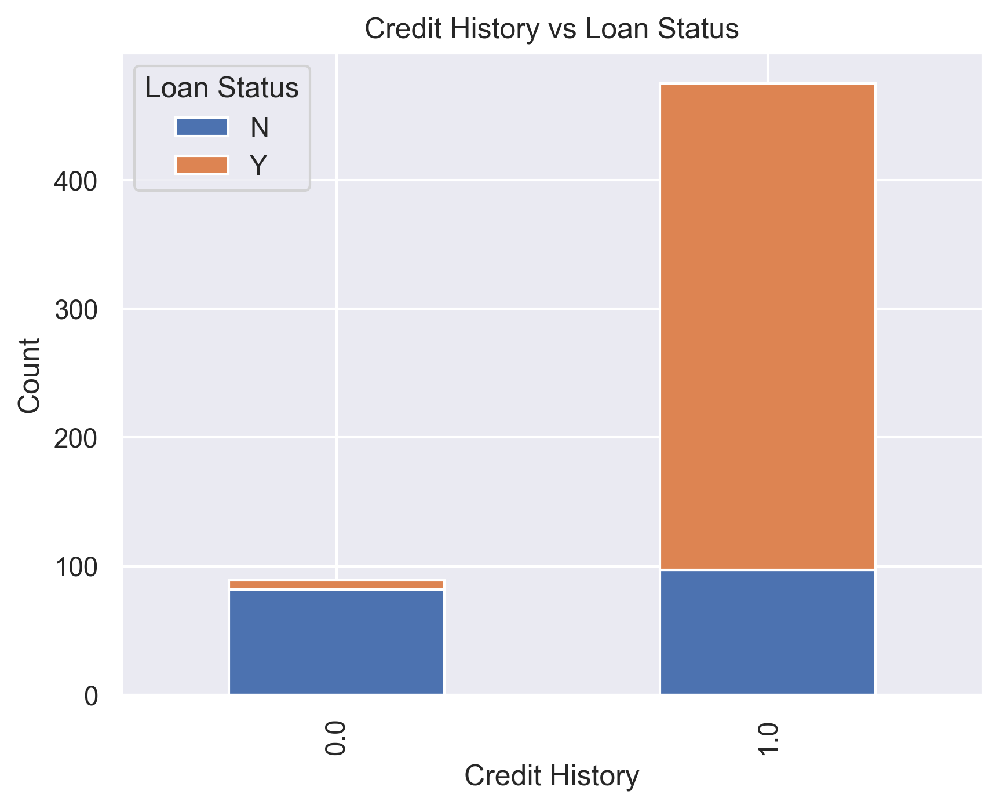
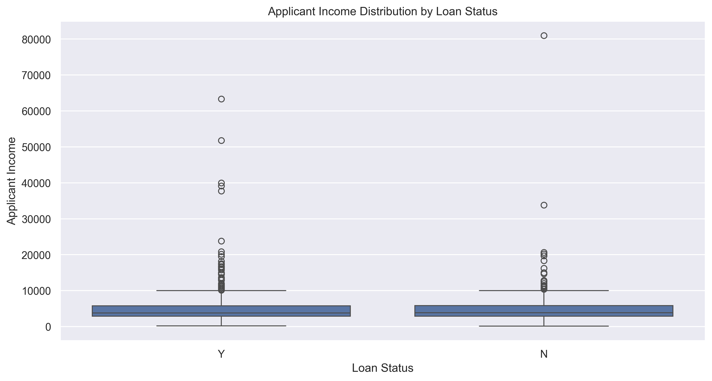
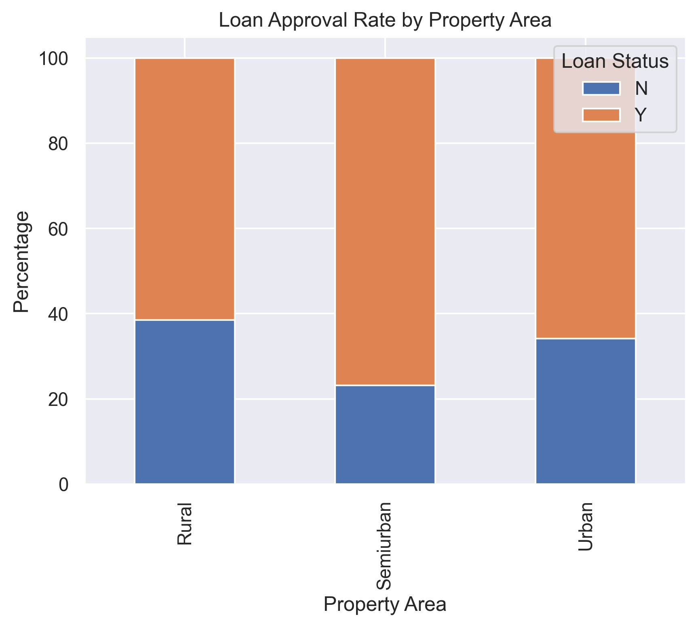
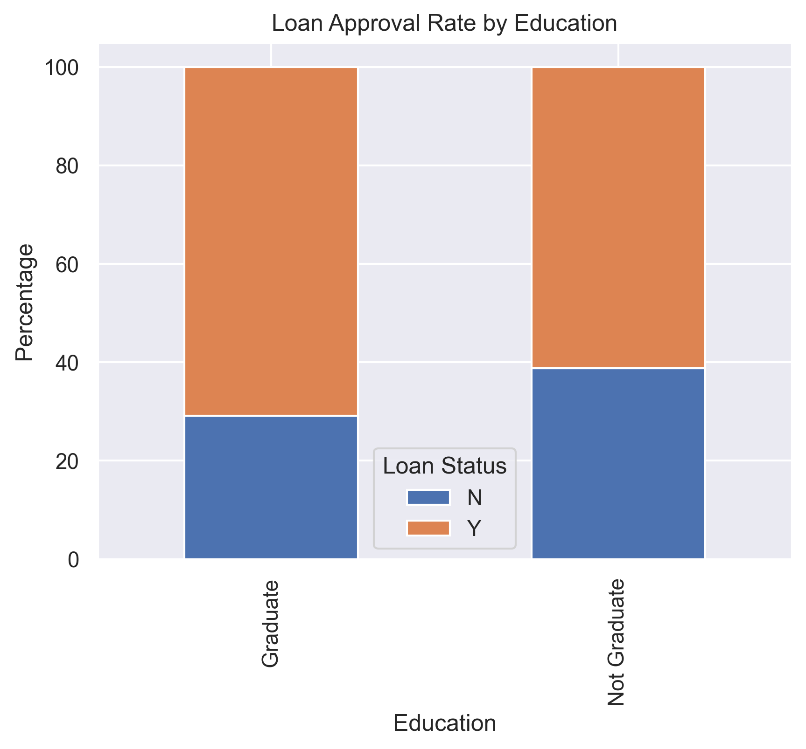

# 🤖 Loan Approval RAG Q&A Chatbot

This project implements a Retrieval-Augmented Generation (RAG) Q&A chatbot for analyzing and querying loan approval data.

## 📖 Overview

The Loan Approval RAG Q&A Chatbot combines:

- **Document Retrieval**: Finds relevant information from the loan dataset
- **Generative AI**: Produces natural language responses based on retrieved data
- **Interactive Interface**: User-friendly Streamlit web application

This enables users to ask natural language questions about loan approval data and receive accurate, data-driven responses.

## 🌟 Key Features

- Natural language querying of loan approval dataset
- Data-driven responses with source citations
- Interactive data exploration and visualizations
- Multiple language model options (OpenAI, Hugging Face, local models)
- Persistent vector store for efficient retrieval

## 🏗️ Architecture

The system follows a classic RAG architecture:

1. **Indexing Phase**:
   - Dataset is loaded and preprocessed
   - Text is chunked and embedded using sentence transformers
   - Vector embeddings are stored in ChromaDB for semantic retrieval

2. **Query Phase**:
   - User query is embedded using the same embedding model
   - Similar documents are retrieved from the vector store
   - Retrieved content is used as context for the language model
   - LLM generates a response based on the context and query

## 🛠️ Installation

### Prerequisites

- Python 3.8+
- Pip package manager

### Setup

1. Clone this repository:
   ```
   git clone <repository-url>
   cd week_8
   ```

2. Install dependencies:
   ```
   pip install -r requirements.txt
   ```

3. Download the dataset:
   - Get the dataset from [Kaggle](https://www.kaggle.com/datasets/sonalisingh1411/loan-approval-prediction)
   - Place `Training Dataset.csv` in the `data/raw` directory

4. Set up environment variables:
   - Create a `.env` file in the project root directory
   - Add API keys (choose at least one):
     ```
     OPENAI_API_KEY=your_openai_api_key
     HUGGINGFACE_API_KEY=your_huggingface_api_key
     ```

## 🚀 Usage

1. Run the Streamlit app:
   ```
   streamlit run app.py
   ```

2. Open your browser at the provided URL (typically http://localhost:8501)

3. Use the chatbot by:
   - Typing questions in the chat input
   - Exploring dataset visualizations in the Dataset Explorer tab
   - Reading about the project in the About tab

## 💬 Sample Questions

- "What is the overall loan approval rate?"
- "How does gender affect loan approval?"
- "Is there a relationship between credit history and loan approval?"
- "What income level has the highest approval rate?"
- "Do married applicants have better chances of loan approval?"
- "What factors most strongly influence loan approval decisions?"

## 📊 Dataset

The chatbot uses the [Loan Approval Prediction dataset](https://www.kaggle.com/datasets/sonalisingh1411/loan-approval-prediction) from Kaggle, which contains information about loan applications including:

- Applicant demographics (gender, marital status, dependents)
- Financial information (income, loan amount, credit history)
- Property details (area, type)
- Loan approval status (target variable)

## 🧩 Project Structure

```
week_8/
├── app.py                 # Streamlit application
├── requirements.txt       # Project dependencies
├── data/
│   ├── raw/               # Raw dataset files
│   └── processed/         # Processed data files
├── models/
│   └── vector_store/      # Persistent vector store files
└── src/
    ├── __init__.py        # Package initialization
    ├── retrieval.py       # Document retrieval functionality
    ├── generator.py       # Text generation functionality
    ├── rag_pipeline.py    # Integration of retrieval and generation
    └── utils.py           # Utility functions
```

## 🔄 Advanced Configuration

You can modify the following constants in `app.py` to change the behavior:

- `DEFAULT_MODEL_TYPE`: Change to "huggingface" or "local" if preferred
- `DEFAULT_MODEL_NAME`: Change to appropriate model name based on type
- `DEFAULT_EMBEDDING_MODEL`: Change the sentence transformer model for embeddings

## 📜 License

This project is released under the MIT License.

## 🙏 Acknowledgments

- This project uses the [LangChain](https://github.com/langchain-ai/langchain) framework
- Dataset provided by [Kaggle](https://www.kaggle.com/datasets/sonalisingh1411/loan-approval-prediction)

## Loan Approval Data Analysis and Streamlit App

## Project Overview
This project analyzes a public loan approval dataset and provides interactive data exploration and visualization using a Streamlit web application. The app allows users to explore key factors affecting loan approval, visualize important trends, and interact with the data through a user-friendly interface.

## Dataset Used
- **Source:** `week_8/data/raw/Training Dataset.csv`
- **Description:**
    - The dataset contains information about loan applicants, including demographic details, financial information, and loan approval status.
    - **Columns:**
        - `Loan_ID`: Unique identifier for each loan application
        - `Gender`, `Married`, `Dependents`, `Education`, `Self_Employed`: Applicant demographics
        - `ApplicantIncome`, `CoapplicantIncome`: Income details
        - `LoanAmount`, `Loan_Amount_Term`: Loan details
        - `Credit_History`: Credit history (1 = good, 0 = bad)
        - `Property_Area`: Urban, Semiurban, or Rural
        - `Loan_Status`: Loan approval outcome (`Y` = approved, `N` = not approved)
    - **Rows:** 614 (after removing header)

## Streamlit App Interface
The application provides an intuitive interface for exploring the dataset, visualizing trends, and understanding the factors influencing loan approval decisions.


*Figure: Streamlit app interface for loan approval data exploration.*

## Visualizations and Insights
All visualizations are generated as PNG files and are available in the `visualizations/` directory.

### 1. Loan Status Distribution

*This pie chart shows the proportion of approved (`Y`) and not approved (`N`) loans. Most applications are approved, but a significant portion are rejected, highlighting the importance of understanding approval criteria.*

### 2. Credit History vs Loan Status

*Applicants with a good credit history (1) have a much higher approval rate compared to those with a bad credit history (0). This underscores the critical role of credit history in loan decisions.*

### 3. Income by Loan Status

*The boxplot reveals that while higher income can be associated with approval, there is considerable overlap. Some low-income applicants are approved, and some high-income applicants are not, indicating that income is not the sole factor.*

### 4. Property Area vs Loan Status

*Loan approval rates vary by property area. Urban and semiurban applicants tend to have higher approval rates compared to rural applicants, possibly due to better access to financial services or different risk profiles.*

### 5. Education vs Loan Status

*Graduates have a slightly higher approval rate than non-graduates, suggesting that education may play a role in the approval process, but it is not a dominant factor.*

## How to Run the App
1. Ensure all dependencies are installed (see `requirements.txt`).
2. Generate the PNG visualizations by running:
   ```bash
   cd week_8/visualizations
   python generate_visualizations.py
   ```
3. Start the Streamlit app:
   ```bash
   streamlit run ../app.py
   ```
4. Open the provided local URL in your browser to interact with the app.

## Directory Structure
- `data/raw/Training Dataset.csv`: The main dataset used for analysis
- `visualizations/`: Contains all generated PNG images and the interface screenshot
- `src/`: Source code for data processing and visualization
- `app.py`: Main Streamlit application

## Conclusion
This project demonstrates how data visualization and interactive web apps can help uncover insights from loan approval data. The analysis highlights the importance of credit history, property area, and other factors in loan decisions, and provides a foundation for further exploration or predictive modeling. 